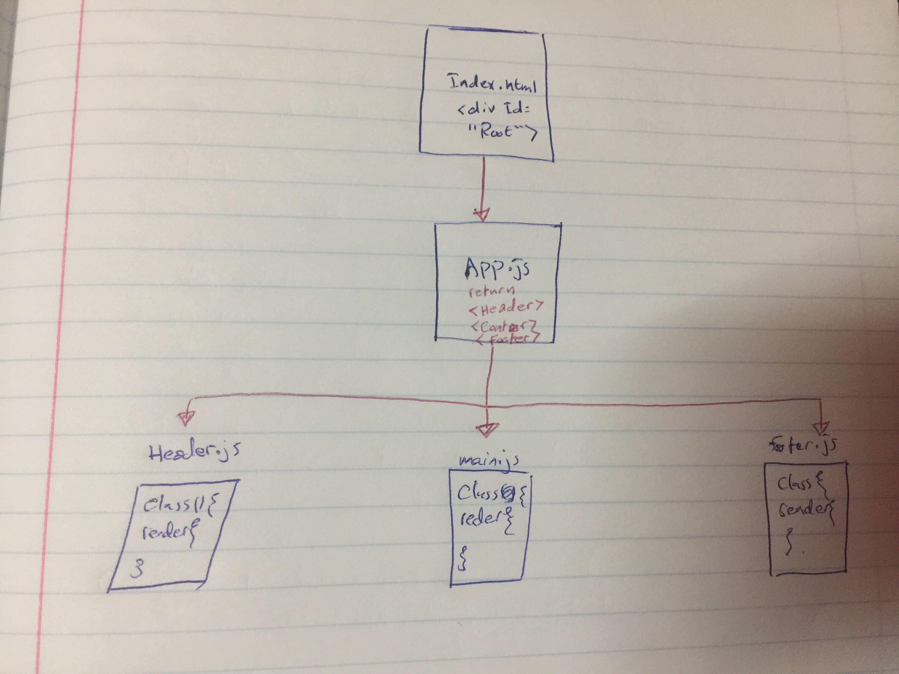

# resty-app
RESTy API testing application using react

### Author: Yasmin Adaileh :sunglasses:

### Links and Resources :paperclip:


### Documentation
- [Submission PR](https://github.com/yasmin-401-advanced-javascript/resty-app/pull/1)
- [Netlify](https://confident-hamilton-4d386a.netlify.app/)

## Library Used

In this app I used only the **react**

### Modules
- `header.js` 
- `main.js`
- `footer.js` 

### Packages
- `scss`


## Instruction How to Install the Library

1. `npx create-react-app resty-app` run it in the command line(Ubuntu)
1. `npm i  scss` run it in the command line(Ubuntu)


## How to run the app? :runner:

in the **Ubuntu** just type:
`npm start` run it in the command line(Ubuntu)


## UML


-------------------------------------------------------------------------


## What is **react** :question:
it's a **javaScript library** created by facebook, and we use it to create javascript **driven dynmic web applications**.

**React** is SPA which mean `Single Page Application`
that mean we'll have only one html file
React basics :star: :
1. components
1. events
1. templates
1. forms

* React routes : warp parameters or redirect.


### What are components? :thought_balloon:
component is a JavaScript class or function that optionally **accepts inputs** like *properties(props)* and **returns** a *React element*

Components can be written using ES6 **arrow function**
`const Greeting = () => <h1>Hello World today!</h1>;`

This is a **functional component** (called Greeting) that takes **no props** and **returns an H1** tag.
**nature** of functional components:
- **Functional** because they are **basically functions**.
- **Stateless** because they do **not hold or manage state**.
- **Presentational** because all they do is **output UI elements**.


Components can also be written using ES6 **classes**
```
class Greeting extends React.Component {
  render(){
    return <h1>Hello World Today!</h1>;
  }
}
```
**nature** of classes components:
- **Class** because they are basically **classes**
- **Smart** because they can **contain logic**
- **Stateful** because they can **hold or manage local state**
- **Container** because they usually **hold/contain numerous** other (mostly functional) **components**

### The Virtual DOM :floppy_disk:
There is a **corresponding** “virtual DOM object.” A virtual DOM object is a **representation of a DOM object**, like a lightweight copy.
A virtual DOM object has the **same properties as a real DOM object**, but it lacks the real thing’s power to **directly change on the screen**.
Manipulating the DOM is slow. Manipulating the **virtual DOM is much faster**, because nothing gets drawn onscreen.

Once the **virtual DOM has updated**, then React **compares** the **updated virtual DOM** with a **virtual DOM before the update**.
By comparing the new virtual DOM with a pre-update version, **React figures out exactly which virtual DOM objects have changed**. This process is called **“diffing**.”

### JSX
it is a **syntax extension** to JavaScript, JSX produces React `“elements”`.

**Embedding** Expressions in JSX:
```
const name = 'Josh Perez';
const element = <h1>Hello, {name}</h1>;

ReactDOM.render(
  element,
  document.getElementById('root')
);
```

JSX inside of `if statements` and for loops:
```
function getGreeting(user) {
  if (user) {
    return <h1>Hello, {formatName(user)}!</h1>;
  }
  return <h1>Hello, Stranger.</h1>;
}
```

Specifying **Attributes** with JSX:
`const element = <div tabIndex="0"></div>;`
`const element = </img>;`

Specifying **Children** with JSX:
`const element = ;`
```
const element = (
  <div>
    <h1>Hello!</h1>
    <h2>Good to see you here.</h2>
  </div>
);

```

JSX Represents **Objects**:
```
const element = (
  <h1 className="greeting">
    Hello, world!
  </h1>
);
```
```
const element = React.createElement(
  'h1',
  {className: 'greeting'},
  'Hello, world!'
);
```

`setState()` schedules an **update** to a component’s **state object**. When state changes, the component responds by **re-rendering**.


we have this file 
[public](./resty-app/public/index.html)
the whole application is inside the **div** with the `root` **id**

